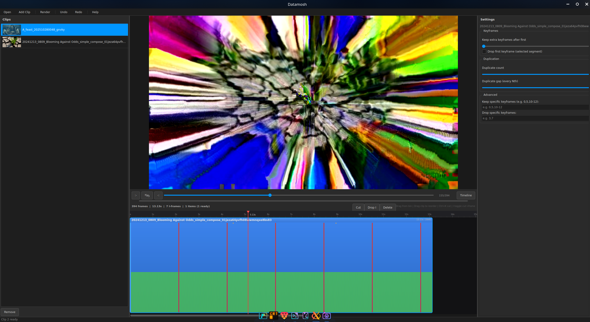

# Datamosh GUI

Interactive timeline-based datamoshing for clip-level I-frame and P-frame manipulation.

Current version: `v1.1.5`.

## Support

If this project helps your workflow, support ongoing development and experiments:

- Patreon: https://www.patreon.com/Seriousshit
- PayPal: https://www.paypal.com/cgi-bin/webscr?cmd=_donations&business=dogme84%40gmail.com&currency_code=USD

## Preview

Screenshot:



Sample output video:

[Download example clip (AVI)](assets/showcase/example-1.avi)

## Changelog

### v1.1.5
- **Fix:** Temp directories from normalization and I-frame injection are now cleaned up when a clip is removed, preventing `/tmp` accumulation over long sessions
- **Fix:** Video info probing (fps, frame count, dimensions) moved off the Qt main thread — no more UI freeze after importing clips
- **Fix:** Timeline scroll wheel now pans; `Ctrl+wheel` zooms (was inverted vs. shortcut docs)
- **Fix:** Clip list view now highlights the correct row when a timeline clip is clicked
- **Fix:** Settings panel controls are now disabled when no clip is selected (prevented silent no-op slider interactions)
- **Fix:** "Cut At Playhead" context menu item disabled on empty timeline
- **Fix:** `UpdateWorker` exceptions no longer permanently block future update checks
- **Fix:** OpenCV video capture handle always released via `finally` (prevents file lock on Windows)
- **Fix:** `RenderDialog` stops its render worker when the dialog is closed mid-render
- **Fix:** Drag-reorder MIME data parse is now validated; malformed drops return `False` cleanly
- **Fix:** Undo/redo stacks use `deque(maxlen=200)` for O(1) eviction
- **Fix:** Timeline hint text contrast raised to meet WCAG AA minimum

## What This App Does

Datamosh GUI is a PySide6 desktop editor built for experimental compression-art workflows.

- Build a sequence from multiple clips on a timeline
- Drag clips from bin to timeline, reorder segments, and cut at playhead
- Control keyframe behavior per clip or per timeline segment
- Toggle "Drop first I-frame" on individual cuts/segments
- Duplicate P-frames to push motion-smear and prediction artifacts
- Preview timeline output before final render
- Undo/redo timeline and settings changes

The app keeps AVI bitstream manipulation in `mosh.py` and uses the GUI as an editor/orchestrator.

## Project Layout

- `main.py`: GUI entrypoint
- `gui/`: active PySide6 application
- `mosh.py`: core AVI parser/rewriter + CLI
- `tests/`: pytest suite
- `legacy/`: old Tkinter-era code (reference only, not active)

## Requirements

- Python 3.10+
- `ffmpeg` and `ffprobe` available on `PATH`

Install Python deps:

```bash
pip install -r requirements.txt
```

## Run

```bash
python3 main.py
```

Or use:

```bash
./launch.sh
```

## Releases & Local Packaging

- Current release page: `https://github.com/willbearfruits/datamosh-gui/releases/tag/v1.1.5`
- Download portal: `https://willbearfruits.github.io/datamosh-gui/`
- Release pipeline: `.github/workflows/release.yml`
- Packaging details: `RELEASES.md`

Local build output naming (Linux host):

- `local-release-artifacts/Datamosh-<version>-linux-portable.tar.gz`
- `local-release-artifacts/Datamosh-<version>-linux-installer.deb`
- `local-release-artifacts/Datamosh-<version>-linux-<arch>.AppImage`
- `local-release-artifacts/SHA256SUMS-linux.txt`

Cross-platform local attempt logs (Linux host):

- `local-release-artifacts/windows-build-attempt.log`
- `local-release-artifacts/macos-build-attempt.log`

## Build Locally

Use native OS runners for release-quality builds. Linux can package Linux artifacts locally; Windows and macOS should be built on their own platforms.

Linux:

```bash
pyinstaller --noconfirm --clean --windowed --name Datamosh \
  --add-data "README.md:." \
  --add-data "LICENSE:." \
  --add-data "VERSION:." \
  main.py
./packaging/linux/build_deb.sh "$(cat VERSION)" "dist/Datamosh" "local-release-artifacts"
./packaging/linux/build_appimage.sh "$(cat VERSION)" "dist/Datamosh" "local-release-artifacts"
```

Windows (PowerShell, run on Windows):

```powershell
pyinstaller --noconfirm --clean --windowed --name Datamosh `
  --add-data "README.md;." `
  --add-data "LICENSE;." `
  --add-data "VERSION;." `
  main.py
```

macOS (run on macOS):

```bash
pyinstaller --noconfirm --clean --windowed --name Datamosh \
  --add-data "README.md:." \
  --add-data "LICENSE:." \
  --add-data "VERSION:." \
  --osx-bundle-identifier com.datamosh.gui \
  main.py
```

## Workflow (GUI)

1. Open one or more source clips.
2. Choose import mode/settings (normalize recommended, direct-AVI optional advanced).
3. Wait for ingest/normalization to complete.
4. Drag clips from bin to timeline and reorder as needed.
5. Use playhead + `Cut` (`Ctrl+K`) to split timeline segments.
6. Inject a one-frame I-frame clip from image/video (`Ctrl+Shift+I`) when needed.
7. Toggle `Drop I` (`I`) for selected segment when needed.
8. Adjust per-clip/segment settings:
   - Keep extra keyframes after first
   - Duplicate count
   - Duplicate gap
   - Keep/drop specific keyframe indices
9. Preview timeline output.
10. Render final AVI.

## Keyboard Shortcuts

- `Ctrl+O`: open clips
- `Ctrl+Shift+O`: add clips
- `Ctrl+R`: render
- `Ctrl+Z`: undo
- `Ctrl+Shift+Z` / `Ctrl+Y`: redo
- `Space`: play/pause preview
- `Left` / `Right`: frame step
- `Ctrl+K`: cut selected timeline segment at playhead
- `Ctrl+Shift+I`: inject single I-frame clip from media
- `I`: toggle drop-first I-frame for selected segment
- `Delete`: remove selected timeline segment
- `F1`: shortcut help

## CLI (Core Engine)

`mosh.py` is usable directly for scripted workflows:

```bash
python3 mosh.py input.avi output.avi --keep-first 1 --duplicate-count 2 --duplicate-gap 3
```

Normalization example:

```bash
python3 mosh.py input.mp4 output.avi --normalize --normalize-preset balanced
```

## Testing

Headless-safe full suite:

```bash
QT_QPA_PLATFORM=offscreen pytest -q
```

## Notes

- Current output target is AVI/Xvid.
- Non-AVI sources are normalized before processing.
- `legacy/` exists for historical reference; active code path is `main.py` + `gui/`.
